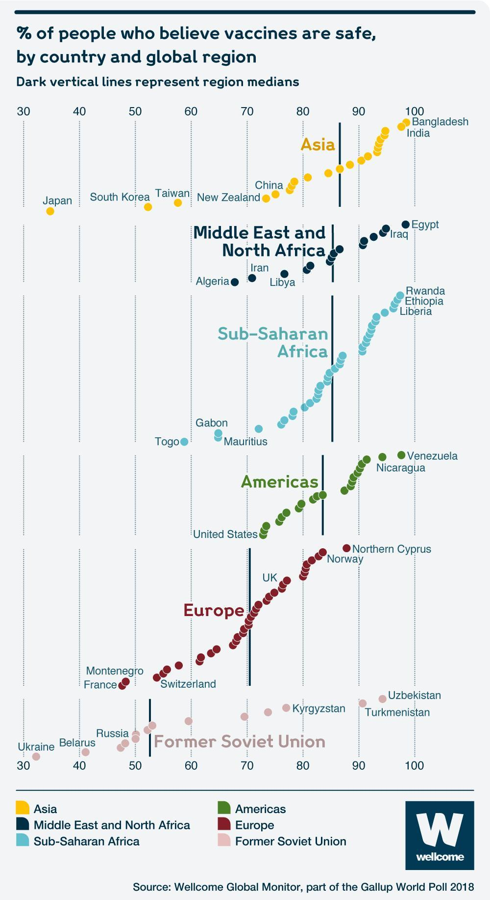

# Lab 2: Advanced Data Visualization

**Create an R Markdown file for all of Lab 2.**

Make sure your final file is carefully formatted, so that each analysis is clear and concise.  Be sure your knitted .html file shows all your source code, including your function definitions. 

## Part One: Identifying Bad Visualizations (100 pts)

If you happen to be bored and looking for a sensible chuckle, you should check out these [Bad Visualisations](https://badvisualisations.tumblr.com/). Looking through these is also a good exercise in cataloging what makes a visualzation good or bad. 

### Dissecting a Bad Visualization

Below is an example of a less-than-ideal visualization from the collection linked above. It comes to us from data provided for the Wellcome Global Monitor 2018 report by the Gallup World Poll 2018:

1. While there are certainly issues with this image, do your best to tell the story of this graph in words. That is, what is this graph telling you? What do you think the authors meant to convey with it?

2. List the variables that appear to be displayed in this visualization.

3. Now that you're versed in the grammar of graphics (ggplot), list the aesthetics used and which variables are specified for each.

4. What type of graph would you call this?

5. List all of the problems or things you would improve about this graph.  

### Improving the Bad Visualization

The data for the Wellcome Global Monitor 2018 report can be downloaded at the following site at the "Dataset and crosstabs for all countries" link on the right side of the page:

[https://wellcome.ac.uk/reports/wellcome-global-monitor/2018](https://wellcome.ac.uk/reports/wellcome-global-monitor/2018)

There are two worksheets in the downloaded dataset file. You may need to read them in separately, but you may also just use one if it suffices.

* Improve the visualization above by either re-creating it with the issues you identified fixed OR by creating a new visualization that you believe tells the same story better.

## Part Two: Broad Visualization Improvement (200 points)

The full Wellcome Global Monitor 2018 report can be found here: [https://wellcome.ac.uk/sites/default/files/wellcome-global-monitor-2018.pdf](https://wellcome.ac.uk/sites/default/files/wellcome-global-monitor-2018.pdf). Surprisingly, the visualization above does not appear in the report despite the citation in the bottom corner of the image!

**For the work below, you must use leaflet at least once. You must also use one of the other packages mentioned this week. More specifically, you cannot just use ggplot for the remainder of the lab assignment.**

### Second Data Visualization Improvement

1. Select a data visualization in the report that you think could be improved. Be sure to cite both the page number and figure title. Do your best to tell the story of this graph in words. That is, what is this graph telling you? What do you think the authors meant to convey with it?

2. List the variables that appear to be displayed in this visualization.

3. Now that you're versed in the grammar of graphics (ggplot), list the aesthetics used and which variables are specified for each.

4. What type of graph would you call this?

5. List all of the problems or things you would improve about this graph.  

6. Improve the visualization above by either re-creating it with the issues you identified fixed OR by creating a new visualization that you believe tells the same story better.

### Third Data Visualization Improvement

1. Select a data visualization in the report that you think could be improved. Be sure to cite both the page number and figure title. Do your best to tell the story of this graph in words. That is, what is this graph telling you? What do you think the authors meant to convey with it?

2. List the variables that appear to be displayed in this visualization.

3. Now that you're versed in the grammar of graphics (ggplot), list the aesthetics used and which variables are specified for each.

4. What type of graph would you call this?

5. List all of the problems or things you would improve about this graph.  

6. Improve the visualization above by either re-creating it with the issues you identified fixed OR by creating a new visualization that you believe tells the same story better.
